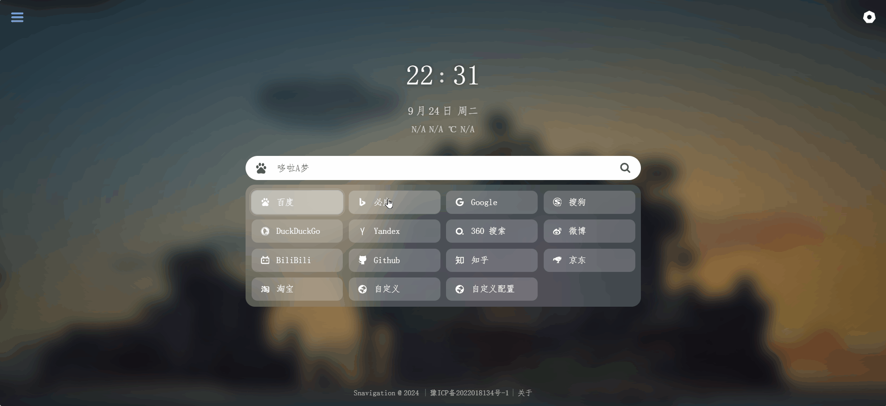
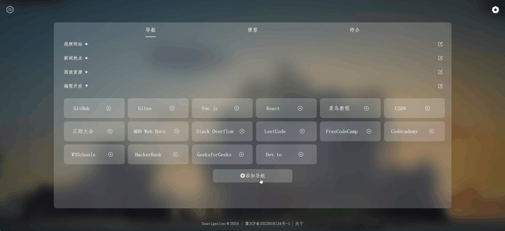
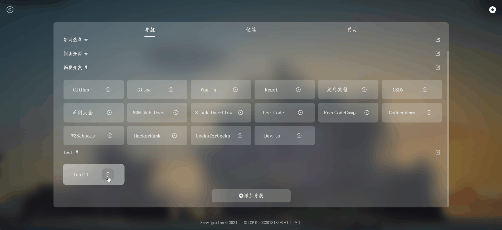

# 🌟 Treasure Navigation

## 📜 项目简介

**Treasure Navigation** 是一个高度自定义的导航页面，旨在帮助用户轻松管理和访问他们最常用的网站。🎯 默认提供了一些精选网站，用户可以根据个人喜好自由添加和管理导航链接。该项目将持续更新，不断引入新功能，欢迎各位开发者共同参与！

## 🛠️ 主要功能

- **自定义导航**：轻松添加、删除或更新导航链接，打造个人化的使用体验。
- **拖拽排序**：通过自由拖拽，轻松重新排序导航链接和分类，让管理变得更简单。
- **批量管理**：支持一次性添加多个导航链接，效率倍增！💪
- **实时搜索**：主页提供快速搜索功能，助你快速找到所需内容，省时省力。
- **持续更新**：我们定期添加新功能，提升用户体验，让你的导航始终保持新鲜感。

## 🌈 背景

1. **广告泛滥**：现在的浏览器充斥着各种广告和标题党，每次搜索时都可能被夸张的信息吸引，一不小心就可能上当受骗，令人苦恼。
2. **收藏夹乱象**：很多人的收藏夹杂乱无章，想快速打开某些网页却常常翻找无果。**Treasure Navigation** 提供了一种整洁、有序的方式来管理常用网址，超越传统的浏览器书签功能，带来更佳的用户体验。

## 🖼️ 图片演示

1. **搜索内容**
   
2. **自由拖拽**
   
3. **添加导航**
   
4. **删除导航**
   

## 🌐 在线演示

- 快来体验我们的 [寻宝导航](https://xionglongbing.github.io/wonderfulJourney/)，一探究竟吧！

## 💻 技术栈

- **Vue 3**
- **TypeScript**
- **Vite**

## 🚀 部署

### 环境要求

请确保已安装 [Node.js](https://nodejs.org/zh-cn/) 环境。

在 `终端` 中输入：

# 安装 pnpm 包管理工具

npm install -g pnpm

# 安装项目依赖

pnpm install

# 启动开发服务器

pnpm dev

### 🔗 API

- [缙哥哥 API](https://www.dujin.org/3618.html)
- [Hitokoto 一言](https://hitokoto.cn/)

## 🙏 特别鸣谢

本站部分样式及功能借鉴自：

- [Snavigation](https://github.com/imsyy/Snavigation)

## 🤝 参与开发

欢迎任何有兴趣的开发者加入我们，共同完善 **Treasure Navigation**！我们期待您的贡献与建议。🌟
