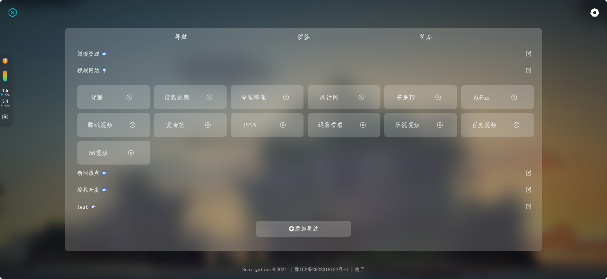
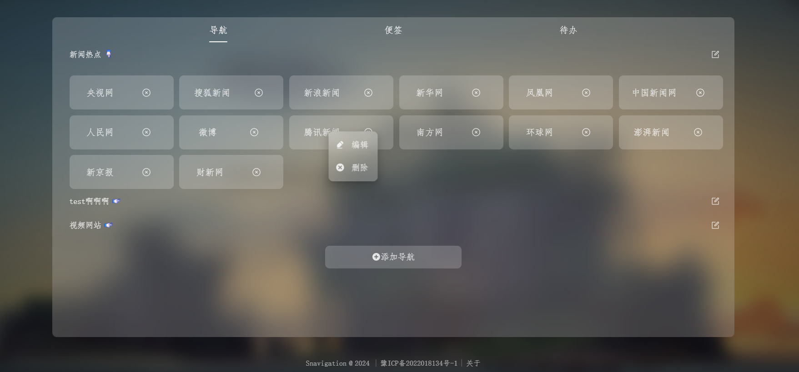

## treasure-navigation

## 项目简介

Treasure Navigation 是一个高度自定义的导航页面，旨在帮助用户轻松管理和访问他们最常用的网站。默认提供了一些网站，用户可以根据个人喜好自由添加和管理导航链接。该项目将持续更新，不断引入新功能，欢迎各位开发者共同参与。

## 主要功能

- 自定义导航：轻松添加、删除或更新导航链接。
- 拖拽排序：自由拖拽以重新排序导航链接和分类。
- 批量管理：支持一次性添加多个导航链接。
- 实时搜索：主页提供快速搜索功能，帮助快速找到所需内容。
- 持续更新：定期添加新功能，提升用户体验。

## 背景

1. 现在一打开的浏览器的广告太多，而且大多是标题党，垃圾广告推送。每次打开网页去搜索信息的时候，或者想要打开某个网页时，都可能一些夸张的信息吸引点进去，一不小心点进去就发现上了大当，容易一发不可收拾
2. 想要收藏某些网页，希望能很快的打开想要浏览的网页。虽然可以用收藏夹来解决，但是我发现很多人的收藏夹乱七八糟。Treasure Navigation 提供了一种整洁、有序的方式来管理常用网址，超越传统的浏览器书签功能，带来更佳的用户体验

## 图片演示





## 在线演示

- [寻宝导航](https://xionglongbing.github.io/wonderfulJourney/)

## 技术栈

- vue3
- typescript
- vite

## 部署

### 环境要求：请确保已安装 [node.js](https://nodejs.org/zh-cn/) 环境

- 在 `终端` 中输入：

  ```bash
  # 安装 pnpm 包管理工具
  npm install -g pnpm

  # 安装项目依赖
  pnpm install

  # 启动开发服务器
  pnpm dev
  ```

### API

- [小歪 API](https://api.ixiaowai.cn/)
- [缙哥哥 API](https://www.dujin.org/3618.html)
- [Hitokoto 一言](https://hitokoto.cn/)

### 特别鸣谢

本站部分样式及功能借鉴自

- [Snavigation](https://github.com/imsyy/Snavigation)

## 参与开发

欢迎任何有兴趣的开发者加入我们，共同完善 Treasure Navigation！我们期待您的贡献与建议。
